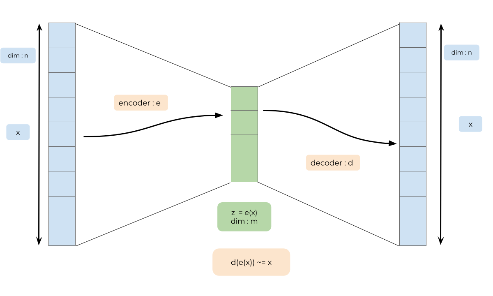
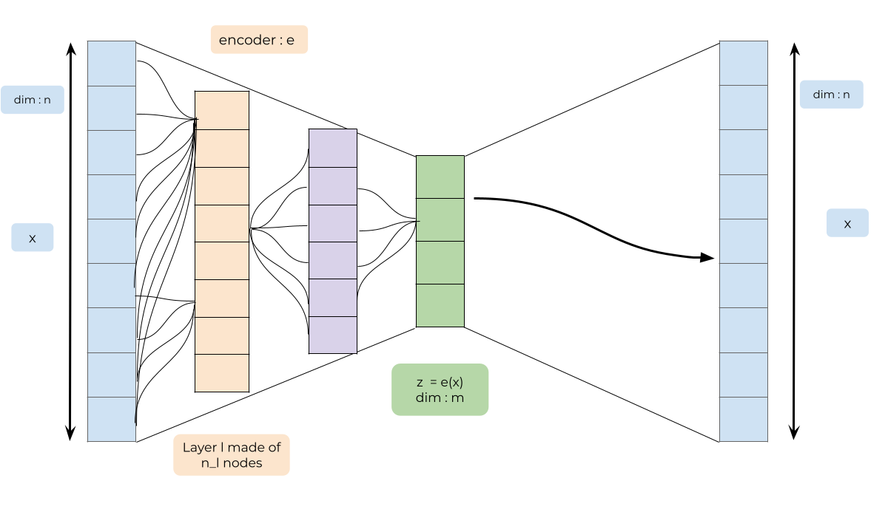
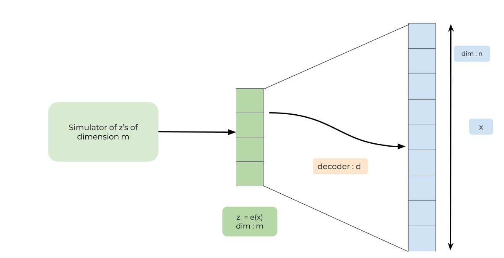
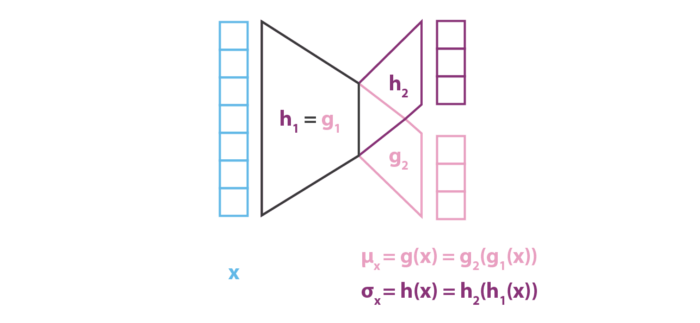

```{r setup, include=FALSE}
knitr::opts_chunk$set(echo = FALSE)
```


# About the auto-encoders

Auto-encoders are used for the reduction of dimension of (large) datasets. 

<br> 
- Let $X$ be our dataset: $\mathbf{X}=(X_i)_{i \in 1, \dots,N_{obs}}$

- $\forall i =1,\dots,N_{obs}$, $X_i \in \mathbb{R}^n$.  

- Looking for two functions 

  - **Encoder** $e :\mathbb{R}^n \mapsto \mathbb{R}^m$   and  

  - **Decoder** $d :\mathbb{R}^m \mapsto \mathbb{R}^n$
  
  -  such that $$X \approx d(e(X)) \Leftrightarrow ||X -   d(e(X)) ||^2 \mbox{ small } $$ 

---

# Autoencoder 

```{r, echo=FALSE, out.width="90%", fig.cap="Autoencoder scheme.",fig.align="center"}

```


---

# About  $d$ and $e$ : neural networks

```{r, echo=FALSE, out.width="90%", fig.cap="Autoencoder scheme.",fig.align="center"}

```


---

# About  $d$ and $e$ : neural networks

 

**One neuron** :     $f_j (\mathbf{x}) = \phi (<w_j, \mathbf {x}> + \, b_j)$   where

 
  - $\phi$ the activation function : non linear
  
  - The quantities $w_j = (w_j^1, \dots, w_j^n)$ are the weights of
    the input variables $(x^1, \dots, x^n)$

  -   $b_j$ is the bias of neuron $j$.


 

**At each layer $\ell$**  of the neural network: 
 

  - Receive $n_{\ell-1}$  input variables $\mathbf{y}^{\ell-1} =(y^{\ell-1}_{1}, \dots,y^{\ell-1}_{n_{\ell-1}})$
  
  - Create $n_\ell$ new variables. For variable $j$ of layer $l$: 
      $$y^{\ell}_{j} = \phi(<w^\ell_j, \mathbf{y}^{\ell-1}>  +  b^{\ell}_j)$$ 
 

**Unknown parameters $\theta$**  
  - $w^\ell_j \in \mathbb{R}^{n_\ell-1}$, for $\ell =1, \dots L$, for $j=1,\dots,n_{\ell}$,
  - $b^\ell_j \in \mathbb{R}$, for $\ell =1, \dots L$, for $j=1,\dots,n_{\ell}$,


---

# Learning $d$ and $e$ 

The parameters $\theta = (w^\ell_j,b^\ell_j)_{j = 1\dots,n_\ell, \ell = 1,\dots,L}$ are calibrated on a dataset $(x_i)_{i=1, \dots , N_{obs}}$ by minimizing the loss function

$$\widehat{\theta} = \mbox{argmin}_{\theta \in\Theta}  \sum_{i=1}^{N_{obs}}||X_i - d_{\theta}\circ e_{\theta}(X_i)||^2$$ 

**Stochastic gradient descent**


---

# PCA versus autoencoder


- Let $W \in M_{n,m}(\mathbb{R})$, $W = (C_1,\dots,C_m)$ $m$ columns vectors $C_i$, $m < n$. **Hyp.**:  $(C_i)$ are orthonormal vectors. Consequently:
  $$W'W = I_n$$
  
  
- Let $W' X_i$ is the projector of vector $X_i$ on the sub-vectorial space generated by the columns of $W$. 
  
-  We are looking for  $W$ minimizing the inertia of the projected dataset: 
$$
\begin{aligned}
W^* &=\mbox{argmax}_{\{W \in M_{n,m}(\mathbb{R}), W'W = I_n\}} \sum_{i=1}^{N_{obs}} || W'X_i||^2\\ &=\mbox{argmin}_{\{W \in M_{n,m}(\mathbb{R}), W'W = I_n\}} \sum_{i=1}^{N_{obs}} || X_i - WW'X_i||^2
\end{aligned}
$$

---

# PCA versus autoencoder

- $W' = e$  **linear** encoder function

- $W = d$ : **linear** decoder function

- Note that if you use neural networks with linear activation function and one layer, you will get $W$ not necessarily orthogonal. 


[Lien vers une démonstration propre](http://www.xavierdupre.fr/app/mlstatpy/helpsphinx/c_ml/rn/rn_9_auto.html)


---

# Using the autoencoder to simulate  


```{r, echo=FALSE, out.width="70%",fig.align="center"}

```


  -   The optimization of the autoencoder supplies $(Z_1, \dots, Z_{N_{obs}}) = (e(x_1), \dots, e(X_{N_{obs}}))$
  
  - **How can we simulate the $z's$ such that $d(z)$ looks like my original data?**  

  -  How to construct a "machine" able to generate coherent other $Z_i$.   
  
  - Need to  constrain/ structure the latent space. 
  
---

# Probabilistic version of the autoencoder
  
  -  **Idea** : put a prior distribution on the latent space et estimate the posterior distribution.  


  - **A statistical model with latent variables**
  
  $$X_i =d(Z_i) + \epsilon_i$$
  $$Z_i \sim_{i.i.d.}N_m(0,I_m)$$
  $$\epsilon_i \sim_{i.i.d.} \mathcal{N}_n(0,c I_n)$$
 
  
  - Likelihood 
   $$\ell(\mathbf{X}; d)  =  \int_{\mathbf{Z}} p(\mathbf{X} | \mathbf{Z};d)p(\mathbf{Z})d\mathbf{Z}$$
  
  **Not explicit**
  
  - EM requires the posterior distribution of $\mathbf{Z}$

  $$p(\mathbf{Z} | \mathbf{X}; d) \propto p(\mathbf{X}|\mathbf{Z}; d)p(\mathbf{Z}) $$
  **Very complex  too**


---

# Approximate the posterior distribution


 - Since  $\ell(\mathbf{X}; d)$  is too difficult to tackle because of the form of $p(\mathbf{Z} | \mathbf{X}; d)$

 - Let's   simplify that distribution 
  $$p(\mathbf{Z}  | \mathbf{X};d) = \prod_{i=1}^{N} p(Z_i |  X_i; d)  \approx q_{\mathbf{X}}(\mathbf{Z};g,H)  = \prod_{i=1}^{N} q_{ X_i}(Z_i;g,H)$$
  $$q_{X_i}(Z_i;g,h) =\mathcal{N}_m(g(X_i),H(X_i))$$


- Replace the likelihood by the ELBO 

 $$
\begin{eqnarray}
 ELBO(d,g,H) &=&\ell(\mathbf{X}; d)-  KL(q(\mathbf{Z};\mathbf{X},g,H), p\mathbf{Z} |\mathbf{X};d))\\
 &=&\mathbb{E}_{q_{\mathbf{X}}(\mathbf{Z}; ,g,H)}[\log p(\mathbf{X} , \mathbf{Z};d)] + Entr(q_{\mathbf{X}}(\mathbf{Z};g,H)))\\
 &=& \mathbb{E}_{q_{\mathbf{X}}(\mathbf{Z};g,H)}[\log p(\mathbf{X} | \mathbf{Z};d)]- KL(q_{\mathbf{X}}(\mathbf{Z};g,H), p(\mathbf{Z}))\\
\end{eqnarray}
 $$
 
 
 
---
# Maximize  a variational lower bound
   $$(\hat{d},\hat{g},\hat{H}) = \mbox{argmin}_{d,g,H} ELBO(d,H,g)$$ 

 $$ELBO(d,g,H)  = \mathbb{E}_{q_{\mathbf{X}}(\mathbf{Z};g,H)}[\log p(\mathbf{X} | \mathbf{Z};d)]- KL(q_{\mathbf{X}}(\mathbf{Z};g,h), p(\mathbf{Z}))$$
 
 - **Reconstruction term**
 
$$\mathbb{E}_{q_{\mathbf{X}}(\mathbf{Z};g,H)}[\log p(\mathbf{X} | \mathbf{Z};d)] = \mathbb{E}_{q_{\mathbf{X}}(\mathbf{Z};g,H)}  \left[\sum_{i=1}^N - \frac{||X_i - f(Z_i)||^2}{2c}\right]$$ 


 - **Regularisation term** :  $KL$
 
- $c$ : variance parameter which balances regularisation and  reconstruction


---

#About d

$d$ neural network function as before

---

#About g and h

 - Are called the "encoder part"
 - $g$ and $H$: 
 - $H(X)$ is a covariance so 
    - it should be a square symetric matrix 
    - **Simplification** : diagonal matrix $H(X) = h'(X)h(X)$
    - $h(X) \in \mathbb{R}^m$
  - $h(X) = h_2(h_1(X))$, $g(X) = g_2(g_1(X))$, $g_1 = h_1$
  
  
```{r, echo=FALSE, out.width="90%",fig.align="center"}

```


    
---
#Evaluation of the expectation

Note that the term 
    $\mathbb{E}_{q_{\mathbf{X}}(\mathbf{Z};g,h)}  \left[\sum_{i=1}^N - \frac{||X_i - f(Z_i)||^2}{2c}\right]$
can not be evaluated. 

So people simulate latent variable

$$\mathbb{E}_{q_{\mathbf{X}}(\mathbf{Z};g,h)}  \left[\sum_{i=1}^N - \frac{||X_i - f(Z_i)||^2}{2c}\right] \approx  \left[\sum_{i=1}^N - \frac{||X_i - f(g(X_i) + diag(h(X_i))\xi_i)||^2}{2c}\right]$$
where $\xi_i\sim \mathcal{N}_m(0,\mathbb{I}_m)$  
    


   
   