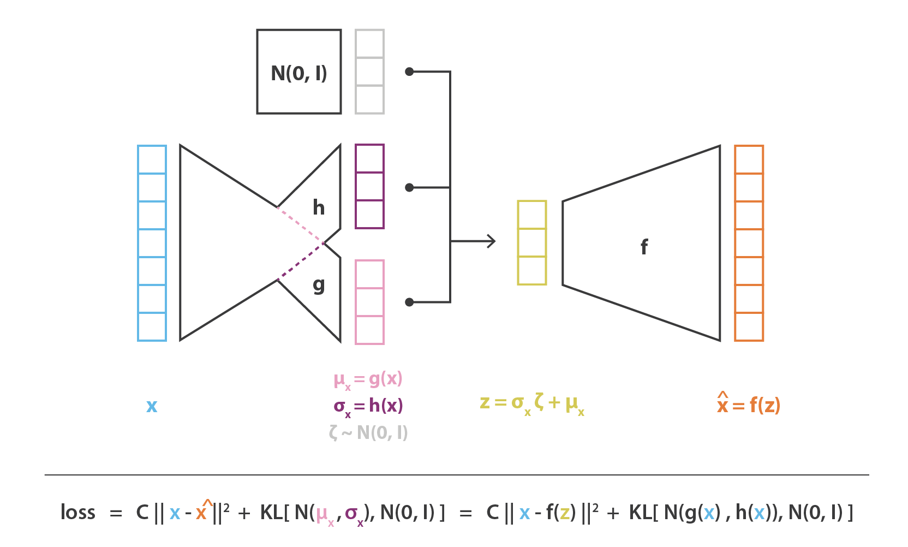

```{r setup}
knitr::opts_chunk$set(echo = TRUE)
library(keras)
library(ggplot2)
library(dplyr)
library(corrplot)
library(FactoMineR) # PCA
library(tensorflow)
if (tensorflow::tf$executing_eagerly())
  tensorflow::tf$compat$v1$disable_eager_execution()
K <- keras::backend()
```

## Introduction : l'apprentissage profond en pratique

Il existe deux grandes "bibliothèques logicielles" pour faire de l'apprentissage profond (deep learning).

1.  [Pytorch](https://pytorch.org/) est une "bibliothèque logicielle" écrite en C++, Python et C, basée sur Torch, développée par les équipes d'intelligence artificielle (IA) de Facebook, déposée en open source sur GitHub en 2017. Selon les blogs, *Pytorch* est réputé être plutôt pour les développeurs orientés recherche, plus convivial, plus facile à adapter et debugger.

2.  [TensorFlow](https://www.tensorflow.org/?hl=fr) est une plateforme Open-Source, proposant un ensemble complet et flexible d'outils, bibliothèques et ressources communautaires pour le "machine learning". C'est aussi une bibliothèque logicielle pour le calcul numérique utilisant des graphiques de flux de données. Les noeuds représentent des fonctions mathématiques et les arêtes des tableaux multidimensionnels (tenseurs) communiquant entre eux. *TensorFlow* a été développé par les équipes de Google et publié en 2015. Le "+" revendiqué est le côté écosystème complet, pas besoin de gérer CPU/GPU et facilitation de mise en production d'outils liés à l'IA.

[Keras](https://keras.io/) est une interface "high-level" pour construire et entraîner des modèles d'apprentissage profond, développée par F. Chollet et qui sert d'interface pour TensorFlow, mais aussi [The MicroSoft Cognitive ToolKit](https://docs.microsoft.com/en-us/cognitive-toolkit/) and [Theano](https://pypi.org/project/Theano/). **Keras** ne se charge pas directement des opérations de bas niveau comme les produits ou les convolutions de Tensor, et s'appuie sur un moteur *backend* (par exemple TensorFlow). **Keras** inclut aussi des ensembles de données et des modèles bien connus, pré-entraînés (sur ImageNet).

Il semble qu'aujourd'hui les deux ont travaillé sur leurs points faibles.

### Et avec R ?

Il existe des bibliothèques R de mêmes noms que celles Python, [tensorflow](https://cran.r-project.org/package=tensorflow), [keras](https://cran.r-project.org/package=keras), [torch](https://cran.r-project.org/package=torch).

1.  **torch** : construction sur PyTorch C++, pas de dépendance à Python, installation plus facile.

2.  Il existe un projet RStudio autour de TensorFlow <https://tensorflow.rstudio.com/> (et donc documentation assez complète) Pour les utilisateurs de R, **tensorflow** et **keras** sont basés sur **reticulate** et revient à utiliser des packages Python depuis R.

L'interface **Keras** a été portée sous R par JJ. Allaire, et évolue avec la philosophie "*make it R-like and natural, where possible and make it easy to port from Python, where necessary*". Vous pouvez lire l'article de blog [ci-dessous](https://blogs.rstudio.com/ai/posts/2021-11-18-keras-updates/) pour plus d'infos sur les dernières évolutions. Il existe aussi le livre Deep Learning with R écrit par F. Chollet et JJ Allaire dont une deuxième version est attendue sous peu.

"Cheatsheet" pour le package R **keras** <https://raw.githubusercontent.com/rstudio/cheatsheets/master/keras.pdf>

### Objectif du tuto

**Comprendre les commandes permettant de construire et entraîner un autoencodeur (variationnel) avec le package keras, depuis RStudio**.

Quelques ateliers passés autour de l'apprentissage profond :

-   Un atelier Happy R avait déjà été proposé autour des réseaux de neurones par Sophie Donnet et Christophe Ambroise : (<https://stateofther.netlify.app/post/introduction-au-deep-learning-sous-r/>)

-   Un autre plus récent a été proposé, avec code Python (pytorch ou keras), par Charles Ollion sur l'apprentissage profond bayésien (<https://stateofther.netlify.app/post/bayesian-deep-learning/>)

## Pré-requis et installation

Pour installer tensorflow et keras et travailler depuis RStudio, suivre les consignes d'installation disponibles [ici](https://tensorflow.rstudio.com/installation/).

Sous Ubuntu, on est un peu pris par la main. Installer le package **keras**.  
Si pas de TensorFlow. Il suffira de lancer la fonction `tensorflow::install_tensorflow()` mais là encore, vous devriez avoir un message explicite. Si besoin on vous proposera d'installer Miniconda.


Pour vérifier son installation tensorflow

```{r, eval = FALSE}
library(tensorflow)
tf$constant("Hellow Tensorflow")
```
Possiblement on verra apparaître des messages d'erreur qui en fait ne conernent que les calculs sur GPU. Si vous n'avez pas de carte GPU ou ne souhaitez pas faire de calculs sur GPU vous pouvez ignorer les messages. 

Si on veut pouvoir utiliser les fonctionnalités GPU, on peut avoir besoin d'installation supplémentaire.

Remarque : pour avoir des infos sur sa carte graphique sous Ubuntu, taper `lspci | egrep "3D|VGA"` dans une console.


## Recette keras

Pour définir le modèle puis l'ajuster, on utilisera toujours les étapes suivantes. 


### 1.  Construction du modèle (configuration des couches)

Dans **keras** on assemble des couches pour **construire un modèle** (mode de construction le plus courant est le mode séquentiel).


`layer_input(shape = NULL)`

`layer_dense(object, units, activation = NULL, use_bias = TRUE, input_shape = NULL)`

Outre la fonction d'activation à spécifier, les schémas d'initialisation des poids (`kernel_initializer`) ou de régularisation des poids (`kernel_regularizer`) peuvent être importants.

### 2.  Processus d'apprentissage

<!-- -->

#### a.  Configuration (methode compile)

`compile(loss='mean_squared_error', optimizer='sgd')`

-   `optimizer` : optimiseur, souvent `"rmsprop"` par défaut.

-   `loss`: fonction de perte à minimiser.

-   `metrics`: métriques à évaluer pendant l'entrainement et le test du modèle.

Ex : pour de la classification

`optimizer = 'adam', loss = 'categorical_crossentropy', metrics = list('accuracy')`


#### b.  Préparer les donnees d'apprentissage

#### c.  Apprentissage (`fit`)

`fit(object, x = NULL, y = NULL, bath_size = NULL, epochs = 10)`

Trois arguments principaux:

-   `epochs`: l'apprentissage est structuré en 'epochs', ie itération sur le jeu entier de données (ce qui fait en lots ('batches') plus petits).

-   `batch_size`: le modèle découpe les données en lots plus petits et itèrent sur chaque lote pendant l'entrainement. *Attention si le nombre total d'échantillons n'est pas divisible par la taille du lot, le dernier batch doit être le plus petit.*

### 3.  Evaluer et prédire


## Réduction de dimension

### Data

The data consists of two datasets that are related to red and white variants of the Portuguese "Vinho Verde" wine. As stated in the description, you'll only find physicochemical and sensory variables included in this data set. The data description file lists the 12 variables. A short description of each variable is available from <https://www.datacamp.com/community/tutorials/deep-learning-python>. The dataset has 11 numerical physicochemical features of the wine, and the task is to predict the wine quality, which is a score between 0 and 10.

Following, [Charles Ollion's tutorial](https://stateofther.netlify.app/post/bayesian-deep-learning/), we will consider the white wine dataset. And while the experts gave integer scores, we will first consider them as continuous values between 0 and 10 and treat this as a regression task, for simplicity and easy interpretation of confidence intervals.

*Attention sur les 4898 vins, il n'y a que 3961 avec des valeurs uniques : des lignes en communs*

```{r loading-the-data}
#wine <- read.csv("http://archive.ics.uci.edu/ml/machine-learning-databases/wine-quality/winequa#lity-white.csv", sep = ";")
wine <- read.csv("http://archive.ics.uci.edu/ml/machine-learning-databases/wine-quality/winequality-red.csv", sep = ";")
dim(wine)
head(wine)
summary(wine)
#wine_old <- wine
#wine <- unique(wine_old)
```

```{r corrplot}
library(corrplot)
# corrplot représente une matrice de corrélation de variables numériques
wine %>% # Dans donnees sols
  select_if(is.numeric) %>% # On ne sélectionne que les colonnes numériques
  cor() %>% # On calcule la matrice de corrélation empirique
  corrplot()
```

```{r donnees_reduites, eval = TRUE}
scaled_data <- wine[,-12] %>%
  select_if(is.numeric) %>% #On ne sélectionne que les colonnes numériques
  mutate_all(.funs = scale) # On applique à touts les colonnes la fonction scale
# La fonction scale centre et réduit un vecteur
y <- wine$quality
```

#### Create training and evaluation datasets

```{r train-and-test-datasets, echo = FALSE}
set.seed(seed = 1616)
dataset_size <- nrow(wine)
train_size <- as.integer(dataset_size * 0.85)
# M = as.integer(train_size / batch_size)
# Training dataset
train_dataset <- wine %>%
  group_by(quality) %>%
  sample_frac(0.85)
# Creation of the test dataset
test_dataset <- anti_join(as_tibble(wine), train_dataset)
# Scale the data
scaled_train <- train_dataset %>%
  select_if(is.numeric) %>%
  mutate_all(.funs = scale)

### Attention mettre à l echelle avec les valeurs du jeu d'entrainement
scaled_test <- test_dataset %>%
  select_if(is.numeric) %>%
  mutate_all(.funs = scale)

```

*Regarder pourquoi importer integer plutot que numeric.*

<!-- dataset_size = 4898 -->

<!-- batch_size = 256 -->

<!-- train_size = int(dataset_size * 0.85) -->

<!-- M = int(train_size / batch_size) -->

<!-- train_dataset, test_dataset = get_train_and_test_splits(train_size, batch_size) -->

### PCA

On fait une ACP sur toutes les données.

```{r resultat_acp}
#res.pca <- PCA(scaled_data[,-12],
#               scale.unit = TRUE, # Option pour centrer et réduire les données
               #ncp = 11, # Nombre de composantes à conserver
#               graph = FALSE)
## plot of the eigenvalues
#barplot(res.pca$eig[,1],main="Eigenvalues",names.arg=1:nrow(res.pca$eig))
#summary(res.pca)
res.pca <- prcomp(scaled_data[,-12])
head(res.pca$x)
factoextra::fviz_eig(res.pca)
#quality_two <- as.factor(wine$quality<=5)
#indpca <- factoextra::fviz_pca_ind(res.pca, col.ind = as.factor(wine$quality), palette = #"lancet")
#factoextra::fviz_pca_ind(res.pca, col.ind = as.factor(wine$quality), palette = "lancet")
# Remarque pb installation factoextra à cause version trop recente de libcuda ??
# Prediction par knn
library(class)
neigh <- knn(scaled_data[,-12], scaled_data[,-12], cl=y,k=3)
# confusion matrix
tab <- table(neigh, y)
# accuracy
sum(diag(tab))/sum(rowSums(tab))*100 # 76.61
## Using the 6 first PC
neigh_red <- knn(res.pca$x[,1:6], res.pca$x[,1:6], cl=y,k=3)
tab <- table(neigh_red, y)
sum(diag(tab))/sum(rowSums(tab))*100 # 74.92

## Prediction individus supplementaires
# Centre-reduire les individus supplementaires
#ind.scaled  <- scale(ind.sup, center = res.pca$center, scale = res.pca$scale)
#ind.sup.coord <- predict(res.pca, newdata = ind.sup)

```

Using 6 variables instead of 11 we achieve almost the same accuracy in our prediction.

```{r pca-reconstruction, eval = FALSE}
pca_recons6 <- reconst(res.pca, ncp=6) # ok avec factoMineR mais pas avec prcomp
pca_recons11 <- reconst(res.pca, ncp=11)
# Qualité reconstruction
rmse_pca5 <- sum((scaled_data-pca_recons5)^2)
rmse_pca5
rmse_pca11 <- sum((scaled_data-pca_recons11)^2)
rmse_pca11
```

### Autoencoder

Définition du modèle


```{r autoencoder-1}
# Ecriture condensée
input_size = 11
m <- 6 # nb de composantes
ae_1 <- keras_model_sequential()
ae_1 %>% 
  layer_dense(units = m, input_shape = input_size, use_bias = TRUE, activation = "linear") %>%
  layer_dense(units = input_size, use_bias = TRUE, activation = "linear") %>%
summary(ae_1)
```

```{r autoencoder-2}
# Ecriture en separant encodeur et decodeur
# Encodeur
enc_input = layer_input(shape = input_size)
enc_output = enc_input %>% 
  layer_dense(units= m, activation = "linear") 
encoder = keras_model(enc_input, enc_output)
# Decodeur
dec_input = layer_input(shape = m)
dec_output = dec_input %>% 
  layer_dense(units= input_size, activation = "linear") 
decoder = keras_model(dec_input, dec_output)
# Auto-encodeur
ae_2_input = layer_input(shape = input_size)
ae_2_output = ae_2_input %>% 
  encoder() %>% 
  decoder()
ae_2 = keras_model(ae_2_input, ae_2_output)
summary(ae_2)
```

```{r}
# Couche encodeur : m*n poids + m terme de biais 
# Couche décodeur : m*n + n termes de biais 
get_config(ae_1)
```

### On compile le modèle en ajoutant fonction de perte et optimiseur

Attention des modifications de valeurs de paramètres peuvent avoir des impacts importants. Exemple du taux d'apprentissage. A ce propos, cet argument a été renommé de `lr` en `learning_rate` (pas encore à jour sur le site de RStudio)). Le Learning rate est noté $\rho$ dans nos  slides de cours.


```{r ae-1-compile}
ae_1 %>% compile(loss='mean_squared_error',
                   optimizer= optimizer_sgd(learning_rate = 0.1) # stochastic gradient descent optimizer
                   )
```

### On ajuste le modèle aux données préparées (rq : besoin de les standardiser au préalable)

Penser à standardiser les données au préalable et à les mettre sous forme de matrice et non de dataframe. Les messages d'erreur sont parfois un peu obscure.

```{r ae-1-fit}
epochs_nb <- 50L
scaled_train <- scaled_data
scaled_train <- as.matrix(scaled_train)
ae_1 %>%  fit(x = scaled_train[,-12], y = scaled_train[,-12], epochs = epochs_nb)
```

Quelques remarques :

-   Pas de contraintes sur les poids décodeurs et les poids encodeurs.

```{r aevsacp}
# h_1 = W_1x+b_1
# x^ = W_2*h_1 + b_2

# les m valeurs singulieres de X_2 = m pc de X

poids <- get_weights(ae_1)
# Poids encodeurs/ decodeurs par defaut
w_encodeur <- poids[[1]] %>% print()
w_decodeur <- poids[[3]] %>% print()

svd_ae1 <- svd(w_decodeur)
#plot(res.pca$svd$vs, svd_ae1$d)
#abline(0,1)
```

```{r}
w_encodeur%*%t(w_encodeur)
w_decodeur%*%t(w_decodeur)
```

```{r}
# Unit Norm: the weights on a layer have unit norm.
sum(w_decodeur^2)/m
#sum(res.pca$svd$vs^2)/length(res.pca$svd$vs)
```

```{r ae1-predict, eval = FALSE}
ae_1predict <- ae_1 %>% predict(scaled_train[,-12])
# Repasser en non standardisé pour comparer...
varcol <- apply(scaled_train[,-12], 2, var)
meancol <- colMeans(scaled_train[,-12])
ae_1predict_or <-  sapply(c(1:11), FUN = function(x) ae_1predict[,x]*sqrt(varcol[x]) + meancol[x])
```

## Variational Autoencoder



```{r variational_autoencoder}
# Parameters --------------------------------------------------------------

batch_size <- 256
latent_dim <- 12L # L spécifie que c'est un entier
# latent dim  = moyenne variance
#intermediate_dim <- 6
epochs_nb <- 50L
epsilon_std <- 1.0
```


# Model definition --------------------------------------------------------
```{r }

# Model definition --------------------------------------------------------

x <- layer_input(shape = c(input_size))
#h <- layer_dense(x, intermediate_dim, activation = "relu")
z_mean <- layer_dense(x, latent_dim)
z_log_var <- layer_dense(x, latent_dim)

# Attention ecriture keras
sampling <- function(arg){
  z_mean <- arg[, 1:(latent_dim)]
  z_log_var <- arg[, (latent_dim + 1):(2 * latent_dim)]
  
  epsilon <- k_random_normal(
    shape = c(k_shape(z_mean)[[1]]), 
    mean=0.,
    stddev=epsilon_std
  )
  
  z_mean + k_exp(z_log_var/2)*epsilon
}

# note that "output_shape" isn't necessary with the TensorFlow backend
z <- layer_concatenate(list(z_mean, z_log_var)) %>% 
  layer_lambda(sampling)

# we instantiate these layers separately so as to reuse them later
#decoder_h <- layer_dense(units = intermediate_dim, activation = "relu")
decoder <- layer_dense(units = input_size, activation = "sigmoid")
#h_decoded <- decoder_h(z)
x_decoded <- decoder(z)

# end-to-end autoencoder
vae <- keras_model(x, x_decoded)


# encoder, from inputs to latent space
encoder <- keras_model(x, z_mean)

# generator, from latent space to reconstructed inputs
decoder_input <- layer_input(shape = latent_dim)
#h_decoded_2 <- decoder_h(decoder_input)
x_decoded_2<- decoder(decoder_input)
generator <- keras_model(decoder_input, x_decoded_2)

vae_loss <- function(x, x_decoded){
  #xent_loss <- (original_dim/1.0)*loss_binary_crossentropy(x, x_decoded_mean)
  mse_loss <- k_sum(loss_mean_squared_error(x, x_decoded))
  kl_loss <- -0.5*k_sum(1 + z_log_var - k_square(z_mean) - k_exp(z_log_var))
     #xent_loss + kl_loss
  mse_loss + kl_loss
}

vae %>% compile(optimizer = "sgd", loss = vae_loss) # rmsprop

vae %>%  fit(x = scaled_train, y = scaled_train, epochs = epochs_nb)


x_test_encoded <- predict(encoder, scaled_train, batch_size = batch_size)
## Representation dans espace latent
x_test_encoded %>%
    as_tibble() %>% 
    mutate(class = as.factor(wine$quality)) %>%
    ggplot(aes(x = V1, y = V2, colour = class)) + geom_point()
## Representation pca
factoextra::fviz_pca_ind(res.pca, col.ind = factor(wine$quality))
```


## Bonus : pour obtenir des résultats plus cohérents entre ACP et autoencodeur linéaire monocouche

](singleAEvsPCA.png)

L'auteur du blog nous dit que souvent les autoencodeurs sont sous-optimaux et qu'ils pourraient être optimisés si on les forçait à avoir les mêmes propriétés que l'ACP à savoir :

-   Tied Weights: equal weights on Encoder and the corresponding Decoder layer.

-   Orthogonal weights: each weight vector is independent of others.

-   Uncorrelated features: output of the encoding layer are not correlated.

-   Unit Norm: the weights on a layer have unit norm.

Tout n'est pas forcément facile à faire avec **keras**. Par exemple, pour créer des poids liés, il est nécessaire de créer

```{r session-info}
reticulate::py_config()
tensorflow::tf_config()
```

## Pour aller plus loin

-   Le package [tfprobability](https://rstudio.github.io/tfprobability/)

# References

Ressources autour de tensorflow, keras et rstudio : - <https://tensorflow.rstudio.com/learn/resources/> - <https://raw.githubusercontent.com/rstudio/cheatsheets/master/keras.pdf> - <https://keras.rstudio.com/articles/examples/variational_autoencoder.html>

Quelques concepts-clefs : - <https://www.analyticsvidhya.com/blog/2017/05/25-must-know-terms-concepts-for-beginners-in-deep-learning/>

Référence du jeu de données P. Cortez, A. Cerdeira, F. Almeida, T. Matos and J. Reis. Modeling wine preferences by data mining from physicochemical properties. In Decision Support Systems, Elsevier, 47(4):547-553, 2009.
